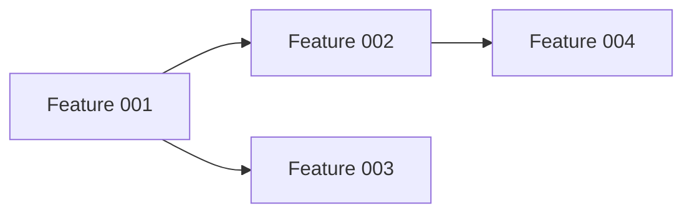

# Project Progress: [PROJECT_NAME]

**Started**: [DATE]
**Target Completion**: [DATE]
**Status**: [X]% complete - [ON TRACK | AT RISK | BLOCKED]

---

## Overview

**Goal**: [One-sentence project goal]
**Features**: [X] total ([Y] complete, [Z] in progress, [W] pending)
**Critical Path**: [Key dependencies or blockers]

---

## Feature Status

| ID | Feature | Priority | Phase | Status | Progress | Blockers |
|----|---------|----------|-------|--------|----------|----------|
| [001] | [Feature Name] | [P1/P2/P3] | [Spec/Plan/Tasks/Impl] | [✅🔄⏳❌] | [X%] | [None/List] |

**Legend**:
- ✅ Complete
- 🔄 In Progress
- ⏳ Pending
- ❌ Blocked

---

## Phase Distribution

| Phase | Count | % Total |
|-------|-------|---------|
| **Specification** | [X] | [Y%] |
| **Planning** | [X] | [Y%] |
| **Tasks** | [X] | [Y%] |
| **Implementation** | [X] | [Y%] |
| **Validation** | [X] | [Y%] |
| **Merged** | [X] | [Y%] |

---

## Priority Breakdown

### P1 - BLOCKER Features
Critical path features that must be completed for project success.

- [ ] [001-feature-name] - [Status] - [Blocker if any]

### P2 - HIGH VALUE Features
Important features that significantly impact value but not blockers.

- [ ] [002-feature-name] - [Status] - [Blocker if any]

### P3 - MEDIUM Value Features
Nice-to-have features that enhance but aren't critical.

- [ ] [003-feature-name] - [Status] - [Blocker if any]

---

## Timeline

### Week 1 ([DATE] - [DATE])
**Planned**:
- [Feature 1]: Specification phase
- [Feature 2]: Planning phase

**Actual**:
- ✅ [Completed items]
- 🔄 [In progress items]
- ⏳ [Pending items]

**Variance**: [On schedule | X days ahead | X days behind]

### Week 2 ([DATE] - [DATE])
*(Same format)*

---

## Metrics

### Velocity
| Metric | Current | Target | Status |
|--------|---------|--------|--------|
| **Features/Week** | [X] | [Y] | [✅🔄❌] |
| **Tasks/Day** | [X] | [Y] | [✅🔄❌] |
| **Test Pass Rate** | [X%] | [99%] | [✅🔄❌] |

### Quality
| Metric | Current | Target | Status |
|--------|---------|--------|--------|
| **Constitution Compliance** | [X/Y] | [100%] | [✅🔄❌] |
| **E2E Test Coverage** | [X%] | [100%] | [✅🔄❌] |
| **i18n Coverage** | [X%] | [100%] | [✅🔄❌] |

---

## Active Blockers

### BLOCKER-001: [Title]
**Impact**: [HIGH | MEDIUM | LOW]
**Affects**: [Feature IDs]
**Description**: [What's blocking]
**Mitigation**: [What's being done]
**Owner**: [Who's responsible]
**ETA**: [Expected resolution date]

---

## Decisions Log

### Decision [DATE]: [Title]
**Context**: [Why needed]
**Options**: [Alternatives considered]
**Chosen**: [Selected option]
**Rationale**: [Why]
**Impact**: [Features affected]

---

## Risk Register

| ID | Risk | Probability | Impact | Mitigation | Owner |
|----|------|-------------|--------|------------|-------|
| R-001 | [Description] | [H/M/L] | [H/M/L] | [Plan] | [Name] |

---

## Dependencies



**Critical Path**: [List features in order]
**Parallelizable**: [List features that can run concurrently]

---

## Daily Standup Template

### [DATE]
**Yesterday**:
- [Completed items]

**Today**:
- [Planned items]

**Blockers**:
- [Issues needing help]

---

## Weekly Review Template

### Week of [DATE]
**Completed**: [X] features, [Y] tasks
**Velocity**: [X] features/week (target: [Y])
**Blockers Resolved**: [X]
**New Blockers**: [Y]

**What Went Well**:
- [Item 1]

**What Needs Improvement**:
- [Item 1]

**Action Items**:
- [ ] [Action 1]

---

## Quick Reference

**Files**:
- Project Progress: `claudedocs/progress.md` (this file)
- Feature Progress: `specs/[FEATURE_ID]/progress.md`

**Commands**:
```bash
# View overall status
cat claudedocs/progress.md

# View feature status
cat specs/*/progress.md | grep "Status:"

# Count completed features
grep "✅" claudedocs/progress.md | wc -l

# Find blockers
grep "BLOCKER" claudedocs/progress.md
```

---

**Last Updated**: [DATE] by [Claude Code | Human]
**Next Update**: [DATE] (update daily during active development)
