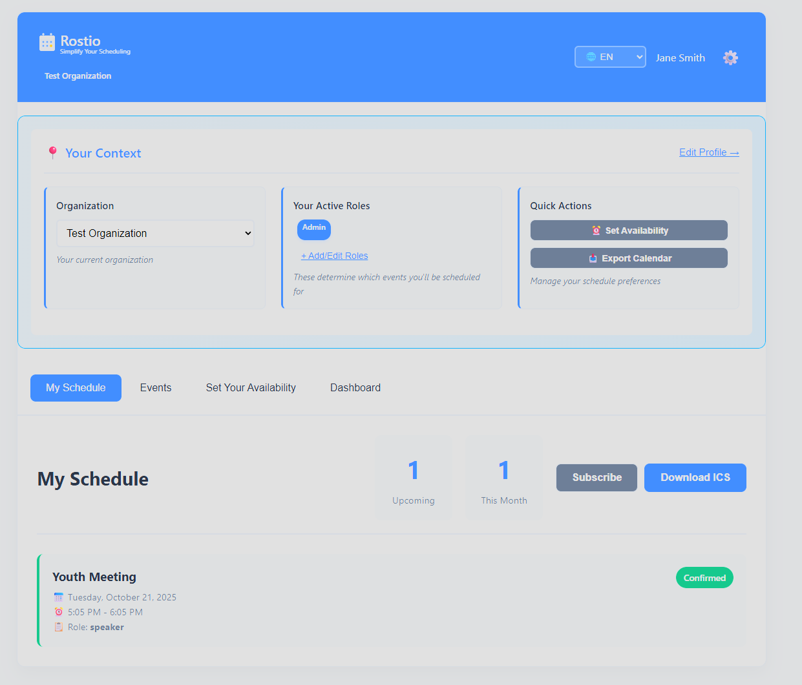
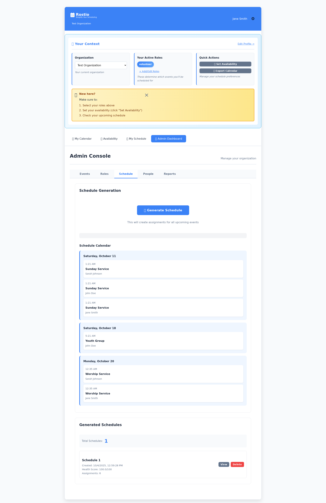
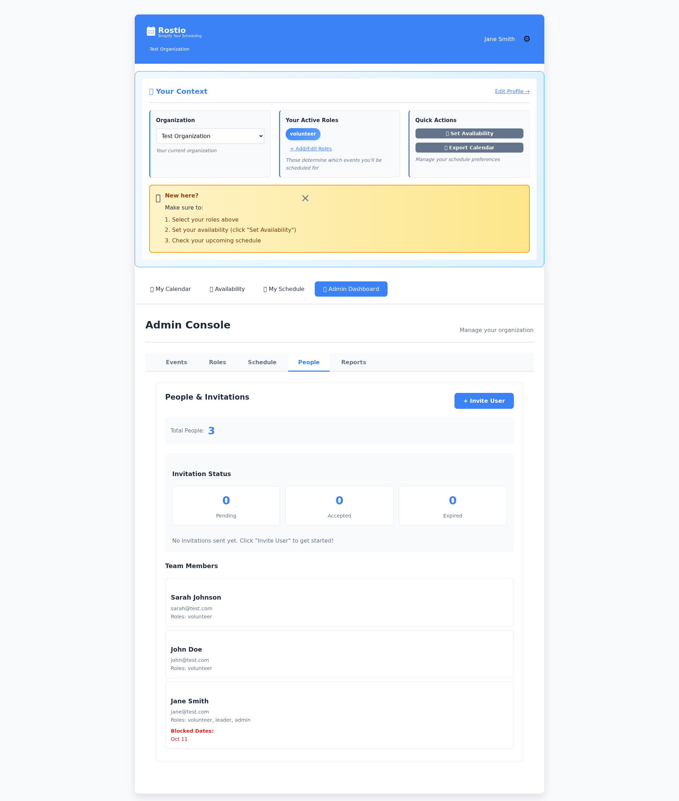
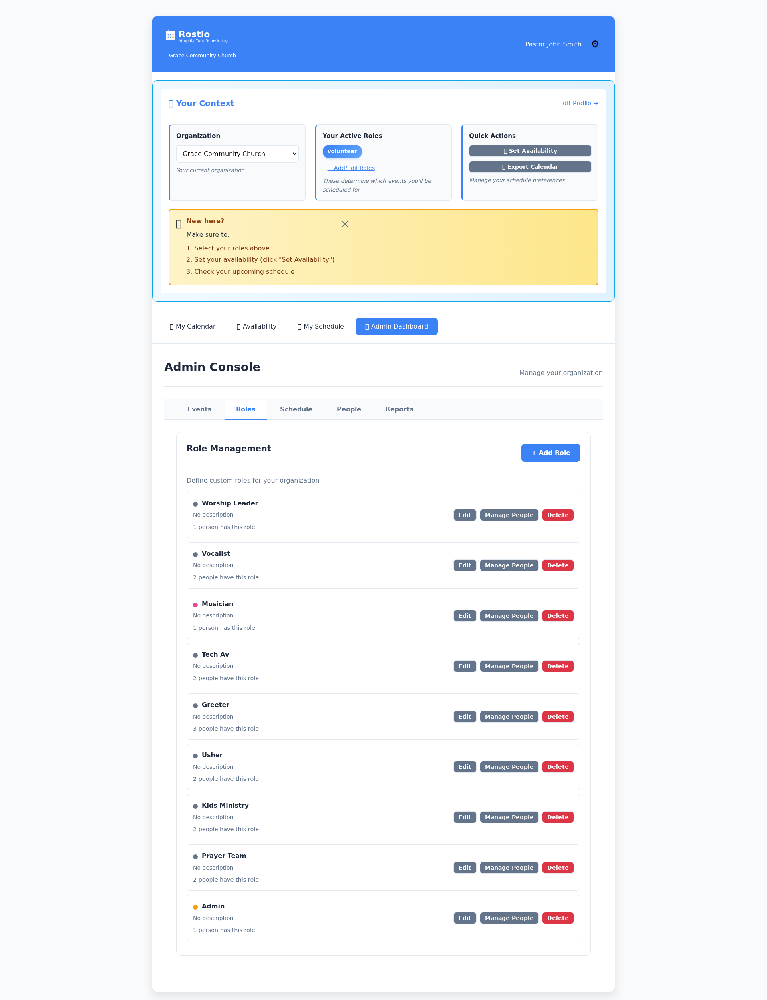
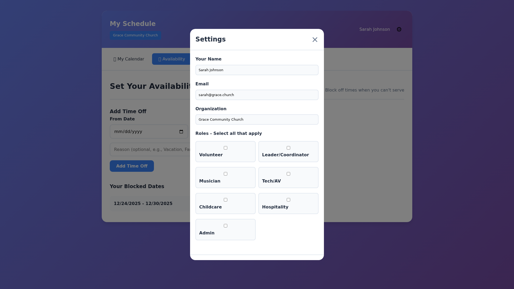
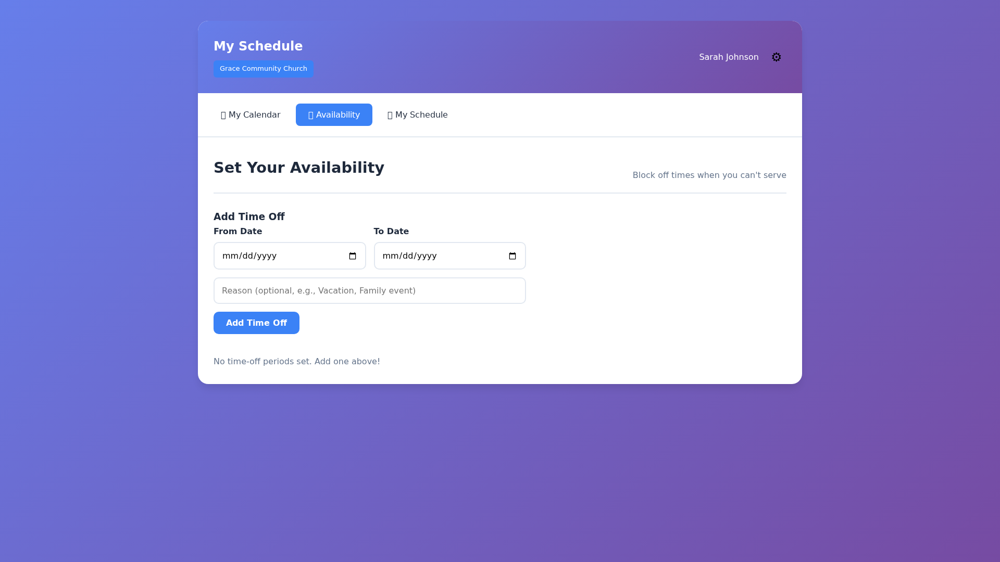

<div align="center">

# 🎯 Rostio

### Modern Volunteer Scheduling & Roster Management

*AI-powered scheduling for churches, non-profits, and organizations*

[](docs/TEST_PERFORMANCE.md)
[](docs/TEST_PERFORMANCE.md)
[](docs/SECURITY_ANALYSIS.md)
[](https://www.python.org/)
[](https://fastapi.tiangolo.com/)
[](LICENSE)

[Features](#-features) • [Quick Start](#-quick-start) • [Documentation](#-documentation) • [Roadmap](#-product-roadmap) • [Contributing](#-contributing)



</div>

---

## 🌟 Features

<table>
<tr>
<td width="50%">

### 🤖 Smart Scheduling
- **AI-Powered Constraint Solver** - Automatically generate optimal schedules
- **Conflict Detection** - Prevent double-booking and overloading
- **Manual Editing** - Fine-tune AI-generated schedules
- **Recurring Events** - Set up repeating services and events

### 📅 Event Management
- **Flexible Event Types** - Worship services, meetings, classes
- **Role Requirements** - Define needed positions per event
- **Multi-location Support** - Manage multiple venues
- **Timezone Aware** - Handle global teams seamlessly

### 👥 Volunteer Management
- **Availability Tracking** - Volunteers set their own schedules
- **Time-off Requests** - Manage blocked dates with reasons
- **Role Assignment** - Assign multiple roles per person
- **Invitation System** - Secure email invitations with tokens

</td>
<td width="50%">

### 🔐 Enterprise Security
- **JWT Authentication** - Industry-standard Bearer token auth
- **Bcrypt Password Hashing** - 12 rounds with auto-salting
- **RBAC Permissions** - Granular admin/volunteer access
- **Audit Logging** - Track all changes (coming soon)

### 📧 Communication
- **Email Notifications** - Assignment alerts (coming soon)
- **Calendar Integration** - ICS export + live webcal sync
- **Multi-language Support** - 6 languages (EN, ES, ZH-CN, KO, TL, VI)
- **SMS Notifications** - Text reminders (coming soon)

### 📊 Analytics & Reports
- **PDF Export** - Print-ready schedules
- **Usage Statistics** - Track volunteer participation
- **Coverage Reports** - Identify gaps in scheduling
- **Custom Dashboards** - Real-time insights

</td>
</tr>
</table>

---

## 🚀 Quick Start

### Prerequisites

```bash
Python 3.11+ | Poetry | SQLite
```

### One-Command Setup

```bash
# Clone the repository
git clone https://github.com/tomqwu/rostio.git
cd rostio

# Install and setup (using Makefile)
make setup

# Start the server
make run

# Visit http://localhost:8000
```

### Manual Installation

```bash
# Install dependencies
poetry install
npm install

# Run database migrations
poetry run python migrate_timezone.py
poetry run python migrate_invitations.py

# Start the server
poetry run uvicorn api.main:app --host 0.0.0.0 --port 8000 --reload
```

### Default Admin Login

```
Email: jane@test.com
Password: password
```

---

## 🛠️ Tech Stack

<div align="center">

| Category | Technologies |
|----------|-------------|
| **Backend** |     |
| **Frontend** |    |
| **Security** |   |
| **Testing** |    |
| **Database** |   (production) |

</div>

---

## 🧪 Testing

### Test Coverage: 281 Passing Tests (99.6% Pass Rate)

```bash
# Quick test (fast, ~10s)
make test

# Fast unit tests only (skip slow password tests, ~7s)
make test-unit-fast

# Full test suite (backend + frontend + E2E, ~50s)
make test-all

# Show timing information
make test-with-timing
```

<details>
<summary><b>📊 Test Breakdown</b></summary>

| Type | Count | Coverage | Runtime |
|------|-------|----------|---------|
| 🔧 **Unit Tests** | 193 | Core logic, models, API | ~11s |
| 🌐 **Frontend Tests** | 50 | JS logic, i18n, router | ~0.4s |
| 🎯 **Comprehensive** | 23 | Integration + API flows | ~25s |
| 🖥️ **GUI i18n** | 15 | i18n regression tests | ~0.7s |
| **Total** | **281** | **Full coverage** | **~50s** |

**Recent Improvements:**
- ✅ 99.6% pass rate (281 passing, 1 legitimately skipped)
- ✅ Fixed critical password reset security vulnerability (bcrypt)
- ✅ Comprehensive i18n testing (15 regression tests)
- ✅ Fast test commands for rapid iteration
- ✅ Performance documentation with optimization strategies

**Key Test Files:**
- [test_gui_i18n_implementation.py](tests/test_gui_i18n_implementation.py) - i18n regression tests
- [test_conftest_mocking.py](tests/unit/test_conftest_mocking.py) - Auth mocking infrastructure
- [test_auth_flows.py](tests/e2e/test_auth_flows.py) - Authentication workflows
- [test_calendar.py](tests/unit/test_calendar.py) - Calendar export
- [comprehensive_test_suite.py](tests/comprehensive_test_suite.py) - Full integration tests

See [TEST_PERFORMANCE.md](docs/TEST_PERFORMANCE.md) for performance details and optimization strategies.

</details>

---

## 📚 Documentation

<div align="center">

| Document | Description |
|----------|-------------|
| 🎯 [SaaS Readiness](docs/SAAS_READINESS_SUMMARY.md) | Gap analysis & launch timeline |
| 🏗️ [Launch Roadmap](docs/LAUNCH_ROADMAP.md) | Week-by-week implementation plan |
| 🔒 [Security Guide](docs/SECURITY_MIGRATION.md) | JWT, bcrypt, best practices |
| 🔐 [RBAC Implementation](docs/RBAC_IMPLEMENTATION_COMPLETE.md) | Role-based access control details |
| 🌐 [API Documentation](http://localhost:8000/docs) | Interactive Swagger UI |
| 🧪 [Test Performance](docs/TEST_PERFORMANCE.md) | Test optimization & performance guide |
| 🌍 [i18n Guide](docs/I18N_QUICK_START.md) | Multi-language setup (6 languages) |

</div>

---

## 🗺️ Product Roadmap

<div align="center">

### 🎯 Current Status: 80% SaaS Ready

```
Core Product:        ████████████████████  100% ✅
Security:            ████████████░░░░░░░░   60% ⚠️
Infrastructure:      ████░░░░░░░░░░░░░░░░   20% ⏳
Pricing/Billing:     ░░░░░░░░░░░░░░░░░░░░    0% 🔜
Email:               ░░░░░░░░░░░░░░░░░░░░    0% 🔜
```

### 📅 6-Week Launch Plan

| Week | Phase | Status |
|------|-------|--------|
| 1-2 | 💰 Billing System (Stripe) | 🔜 Planned |
| 3 | 📧 Email Infrastructure (SendGrid) | 🔜 Planned |
| 4-5 | 🐳 Production Deployment (Docker + PostgreSQL) | 🔜 Planned |
| 6 | 🔒 Security & Monitoring | 🔜 Planned |
| **6** | **🚀 LAUNCH READY** | **🎯 Target** |

### 💰 Pricing Model (Planned)

| Plan | Price | Volunteers | Features |
|------|-------|-----------|----------|
| 🆓 **Free** | $0/mo | 10 | Basic scheduling, 5 emails/month |
| ⭐ **Starter** | $29/mo | 50 | AI scheduling, unlimited emails, calendar export |
| 💼 **Pro** | $99/mo | 200 | Multi-org, SMS, priority support, analytics |
| 🏢 **Enterprise** | Custom | Unlimited | White-label, SSO, dedicated support, SLA |

**Break-even:** 7-10 customers | **Target:** 100 signups, 10 paid customers (90 days)

</div>

---

## 🎯 Key Endpoints

### Authentication
```http
POST /api/auth/signup      # Create account (returns JWT)
POST /api/auth/login       # Login (returns JWT)
GET  /api/people/me        # Get current user (requires auth)
PUT  /api/people/me        # Update profile (requires auth)
```

### Invitations
```http
POST   /api/invitations              # Create invitation (admin)
GET    /api/invitations              # List invitations (admin)
POST   /api/invitations/{token}/accept # Accept invitation
DELETE /api/invitations/{id}         # Cancel invitation (admin)
```

### Calendar Export
```http
GET  /api/calendar/export           # Download ICS file (auth)
GET  /api/calendar/subscribe        # Get webcal URL (auth)
GET  /api/calendar/feed/{token}     # Public calendar feed
POST /api/calendar/reset-token      # Reset subscription token (auth)
```

**Interactive Docs:** Visit `http://localhost:8000/docs`

---

## 🎨 Screenshots

<div align="center">

<table>
<tr>
<td width="50%">

### 📅 AI-Powered Scheduling


Generate optimal schedules with constraint solving

</td>
<td width="50%">

### 👥 Team Management


Manage volunteers and send invitations

</td>
</tr>
</table>

<details>
<summary>📸 <b>View More Screenshots</b></summary>

<br>

<table>
<tr>
<td width="33%">

<br><i>Roles Management</i>
</td>
<td width="33%">

<br><i>User Settings</i>
</td>
<td width="33%">

<br><i>Availability Tracking</i>
</td>
</tr>
</table>

</details>

</div>

---

## 🤝 Contributing

We welcome contributions! Here's how to get started:

1. 🍴 **Fork** the repository
2. 🌿 **Create** a feature branch: `git checkout -b feature/amazing-feature`
3. ✅ **Write** tests for your changes
4. 📝 **Commit** your changes: `git commit -m 'Add amazing feature'`
5. 📤 **Push** to the branch: `git push origin feature/amazing-feature`
6. 🎉 **Open** a Pull Request

### Development Guidelines

- ✅ Write tests for all new features (maintain 100% pass rate)
- 📚 Update documentation for user-facing changes
- 🎨 Follow existing code style and patterns
- 🔒 Security-first mindset (no hardcoded secrets)
- 🌍 Support internationalization (add translations)

---

## 🌍 Community & Support

<div align="center">

### Get Help

[](https://github.com/tomqwu/rostio/issues)
[](docs/)

### Stay Updated

[](https://github.com/tomqwu/rostio)

</div>

---

## 📄 License

This project is licensed under the **MIT License** - see the [LICENSE](LICENSE) file for details.

---

<div align="center">

## ⭐ Star Us!

If Rostio helps your organization, please consider starring the repo to show your support!

[](https://github.com/tomqwu/rostio)

---

**Made with ❤️ by the Rostio Team**

*Simplifying volunteer scheduling for organizations worldwide*

[Report Bug](https://github.com/tomqwu/rostio/issues) • [Request Feature](https://github.com/tomqwu/rostio/issues) • [View Roadmap](#%EF%B8%8F-product-roadmap)

</div>
