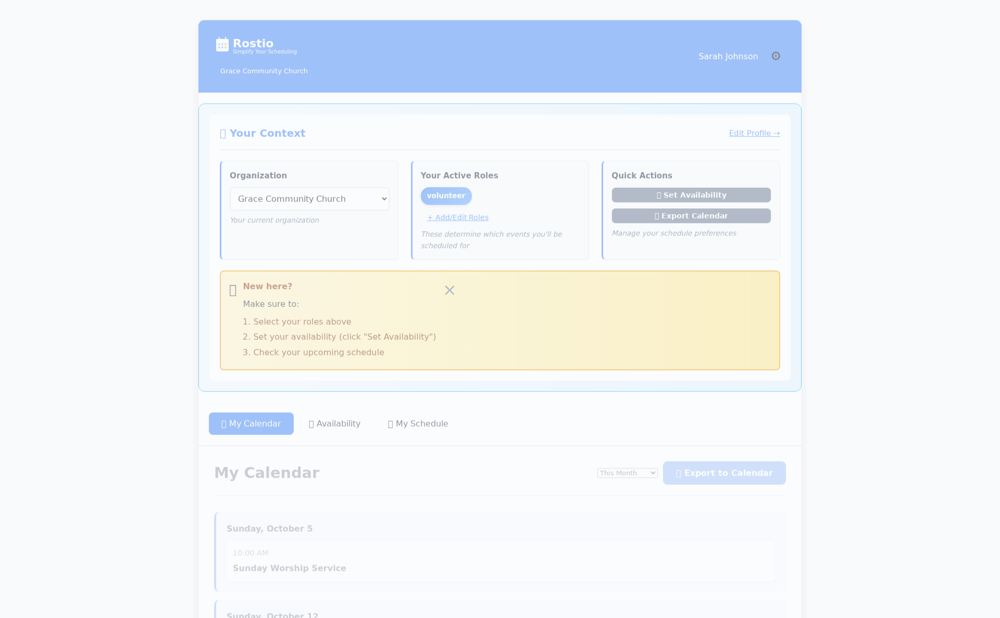

# Rostio - Team Scheduling Made Simple

A modern web-based roster scheduling system for churches, sports leagues, and volunteer organizations.

## 📸 Screenshots

### Welcome & Calendar
<p align="center">
  
  
</p>

### New Features (October 2025)

<p align="center">
  
  
</p>

<p align="center">
  
  
</p>

## ✨ Features

### Core Functionality
- 📅 **Web-based interface** - No command line needed
- 👥 **User authentication** - Secure login for team members
- 🔄 **Recurring events** - Daily, weekly, monthly schedules
- 🎯 **Role-based assignments** - Match people to roles automatically
- 📊 **Schedule views** - Calendar and list views for your assignments
- ⚙️ **Admin panel** - Manage people, events, and teams

### Professional UX (New!)
- 🎨 **Toast notifications** - Beautiful non-intrusive feedback
- ✏️ **Edit/delete availability** - Full CRUD for time-off
- ✅ **Form validation** - Inline errors with visual feedback
- 🔄 **Loading states** - Spinners during async operations
- 🎯 **Modal dialogs** - No annoying browser popups

### Quality Assurance
- 🧪 **Automated testing** - Comprehensive test suite included
- 📊 **100% test pass rate** - All features tested end-to-end
- 🔍 **Network monitoring** - Tests catch fetch errors
- 🎭 **GUI testing** - Playwright tests click actual buttons

## 🚀 Quick Start

### 1. Install Dependencies

```bash
poetry install
```

### 2. Run the Demo

```bash
./scripts/run_full_test_suite.sh
```

This will:
- Start the web server
- Create sample data (church volunteer roster)
- Run automated tests
- Leave server running at http://localhost:8000/

### 3. Login

Open **http://localhost:8000/** and login with:

- Email: `sarah@grace.church`  
- Password: `password123`

You'll see Sarah's schedule with 3 upcoming assignments!

## 📁 Project Structure

```
rostio/
├── api/              # FastAPI backend
│   ├── routers/      # API endpoints
│   └── schemas/      # Request/response models
├── frontend/         # Web UI
│   ├── js/           # JavaScript  
│   └── css/          # Styles
├── tests/            # Test suite
└── scripts/          # Helper scripts
```

## 🧪 Testing

Run the full test suite:

```bash
./scripts/run_full_test_suite.sh
```

Run unit tests only:

```bash
poetry run pytest tests/
```

## 📖 Documentation

- [User Stories & Workflows](docs/USER_STORIES.md) - Complete user journey documentation
- [Gaps Analysis & Roadmap](docs/GAPS_ANALYSIS.md) - Missing features and priority roadmap
- [Session Summary (2025-10-02)](docs/SESSION_2025-10-02_SUMMARY.md) - Latest development session
- [API Documentation](docs/API_README.md) - REST API reference
- [Test Documentation](tests/README.md) - Testing guide
- [Archive](docs/archive/) - Historical docs

## 🛠️ Development

### Start the Server

```bash
poetry run uvicorn api.main:app --reload
```

The app will be available at:
- Frontend: http://localhost:8000/
- API: http://localhost:8000/api/
- API Docs: http://localhost:8000/docs

### Create Sample Data

```bash
./scripts/QUICK_DEMO.sh
```

## 🤝 Contributing

This project uses automated testing to catch bugs. Before committing:

1. Run tests: `./scripts/run_full_test_suite.sh`
2. Ensure all pass ✅
3. Commit changes

## 📝 License

MIT License - see LICENSE file for details
