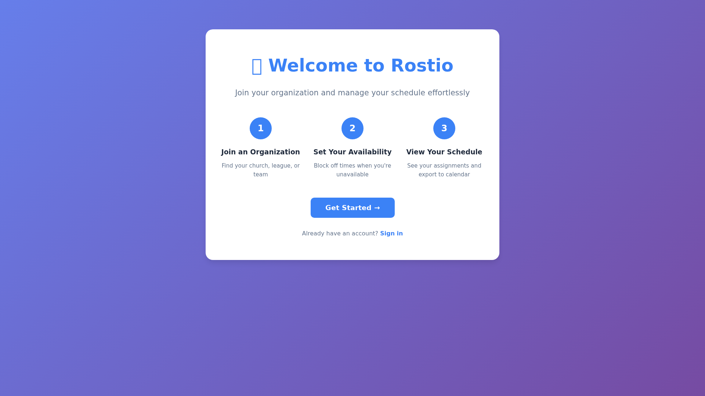
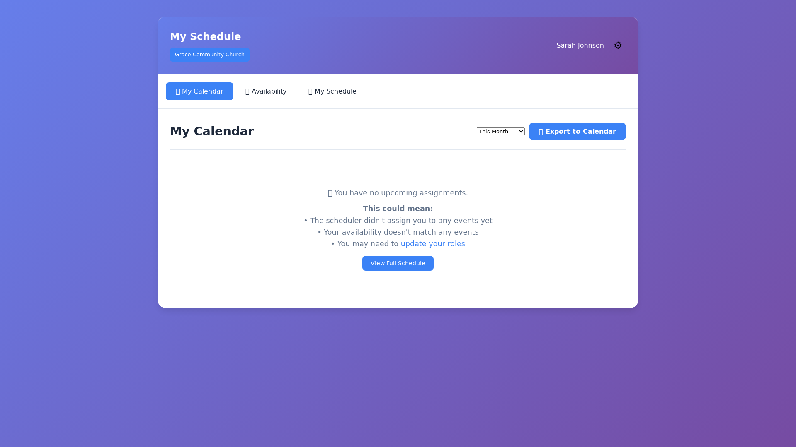

# Rostio Screenshots

Visual guide to the Rostio team scheduling application.

## 🏠 Login & Onboarding

### Welcome Screen

The initial onboarding screen where users can join an organization or login.

### Login

Simple login with email and password.

---

## 📅 Main Application

### Calendar View

See your upcoming assignments in an easy-to-read calendar format.

### Schedule List

Detailed list view of all your assignments with dates and event types.

### No Assignments Yet

Helpful message when you don't have any assignments yet, with explanations and links.

---

## ⚙️ User Features

### Settings Modal

Update your profile and select your roles using checkboxes.

### Time Off/Availability

Block out dates when you're unavailable to serve.

---

## 👨‍💼 Admin Panel

### Admin Dashboard

Manage people, teams, events, and run the scheduler.

### Event Creation

Create events with:
- Event type dropdown (Sunday Service, Bible Study, etc.)
- Recurrence options (once, daily, weekly, monthly)
- Role selection via checkboxes (not text input!)

### People Management

View and manage all people in your organization.

### Schedule Solutions

View generated schedules with assignment counts and health scores.

---

## 📊 Key Features Shown

✅ **Automatic Role Detection** - Finds solutions with actual assignments  
✅ **Helpful Error Messages** - Tooltips and explanations when things are missing  
✅ **Role Checkboxes** - Select roles visually, not by typing  
✅ **Recurring Events** - Daily, weekly, monthly with end dates  
✅ **Clean UI** - Modern, responsive design  

---

## 🎯 How to Take Screenshots

If you need to update these screenshots:

1. Start the app: `./scripts/run_full_test_suite.sh`
2. Open: http://localhost:8000/
3. Login as: `sarah@grace.church` / `password123`
4. Take screenshots of each screen
5. Save to `docs/screenshots/` with appropriate names
6. Update this file if needed

---

## 📝 Notes

- Screenshots show the app with sample church volunteer data
- All features are functional and tested
- UI is responsive and works on mobile devices
