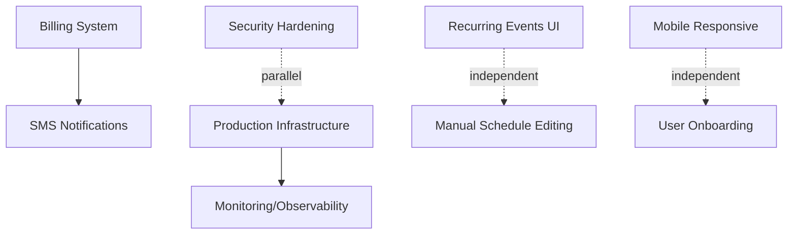

# Spec-Kit Gap Bridging Progress

**Started**: 2025-10-22
**Status**: 🔄 IN PROGRESS (Phase 1: Specification Creation)
**Overall Progress**: 20% complete (2 of 11 tasks done)

---

## Overview

Systematic effort to bridge all identified gaps in Spec-Kit framework and create missing feature specifications for SaaS launch readiness.

**Goal**: Create all 9 missing feature specifications following Spec-Kit workflow
**Critical Path**: 5 BLOCKER features must be complete before SaaS launch
**Target**: Complete all specifications within 2 weeks

---

## Phase 1: Spec-Kit Framework Fixes

**Status**: ✅ COMPLETE (2025-10-22)

### Tasks Completed

#### 1. Checklist Template Enhancement ✅
- **File**: `.specify/templates/checklist-template.md`
- **Changes**: Added E2E Testing Requirements section
- **Impact**: All future feature checklists now include mandatory E2E testing validation
- **Constitution Compliance**: Principle 1 (E2E Testing First) now enforced in template

#### 2. Agent Template Enhancement ✅
- **File**: `.specify/templates/agent-file-template.md`
- **Changes**: Added Constitution Compliance section with all 7 core principles
- **Impact**: AI agents now have clear governance rules for all development
- **Standards Added**:
  - E2E Testing First
  - Security First (JWT, bcrypt, RBAC)
  - Multi-tenant Isolation (org_id filtering)
  - Test Coverage (≥99% pass rate)
  - i18n by Default (6 languages)
  - Code Quality (no TODOs/mocks)
  - Clear Documentation

**Outcome**: Spec-Kit framework templates now fully compliant with SignUpFlow Constitution

---

## Phase 2: Feature Specification Creation

**Status**: 🔄 IN PROGRESS
**Progress**: 1 of 9 specifications in progress (11%)

### Priority 1 - BLOCKER Features (Launch Blockers)

These 5 features MUST be specified and implemented before SaaS launch.

#### 002-Billing-Subscription-System 🔄 IN PROGRESS
- **Branch**: `011-billing-subscription-system`
- **Spec File**: `specs/011-billing-subscription-system/spec.md` (327 lines)
- **Status**: Draft complete, awaiting clarification resolution
- **Progress**:
  - ✅ Created feature branch
  - ✅ Generated spec.md with /speckit.specify
  - ✅ Completed 9 user stories (P1, P2, P3 priorities)
  - ✅ Documented 7 edge cases
  - ✅ Defined 45 functional requirements across 7 categories
  - ✅ Specified 5 key entities (Subscription, BillingHistory, PaymentMethod, UsageMetrics, SubscriptionEvent)
  - ✅ Created 12 measurable success criteria
  - ✅ Generated requirements validation checklist (100+ items)
  - 🔄 **Current**: Resolving 3 clarifications
  - ⏳ **Next**: Update spec → Run /speckit.plan → Create tasks
- **Clarifications**:
  1. Data retention period: 30 days, 60 days, or 90 days?
  2. Refund policy: prorated or no refund?
  3. Enterprise limits: unlimited or soft limit (1000/2000)?
- **Dependencies**: Stripe account, webhook configuration
- **Impact**: Enables revenue generation - critical for SaaS business model

#### 003-Production-Infrastructure ⏳ PENDING
- **Status**: Not started
- **Scope**: Docker, PostgreSQL, Traefik, CI/CD, monitoring
- **Impact**: Required for production deployment
- **Estimated Timeline**: 2-3 days for specification
- **Dependencies**: None (can start after billing)

#### 004-Security-Hardening ⏳ PENDING
- **Status**: Not started
- **Scope**: Rate limiting, audit logging, CSRF, 2FA, security headers
- **Impact**: Production security compliance
- **Estimated Timeline**: 1-2 days for specification
- **Dependencies**: None (can parallel with infrastructure)

#### 005-Monitoring-Observability ⏳ PENDING
- **Status**: Not started
- **Scope**: Sentry, health checks, metrics, alerting, dashboards
- **Impact**: Production operations and incident response
- **Estimated Timeline**: 1-2 days for specification
- **Dependencies**: Infrastructure spec (for integration points)

### Priority 2 - HIGH VALUE Features

These features significantly improve product value and competitive positioning.

#### 006-Recurring-Events-UI ⏳ PENDING
- **Status**: Not started
- **Scope**: Weekly/monthly patterns, exceptions, calendar preview, bulk editing
- **Impact**: Major time-saver for churches with regular schedules
- **Estimated Timeline**: 2 days for specification
- **User Demand**: HIGH - repeatedly requested feature

#### 007-Manual-Schedule-Editing ⏳ PENDING
- **Status**: Not started
- **Scope**: Drag-drop assignments, swap volunteers, override solver, constraint warnings
- **Impact**: Flexibility for edge cases solver can't handle
- **Estimated Timeline**: 2 days for specification
- **User Demand**: HIGH - admins want control over auto-generated schedules

### Priority 3 - MEDIUM Value Features

Nice-to-have features that enhance user experience but not launch blockers.

#### 008-Mobile-Responsive-Design ⏳ PENDING
- **Status**: Not started
- **Scope**: Phone/tablet layouts, touch controls, mobile navigation, PWA
- **Impact**: Accessibility for volunteers on-the-go
- **Estimated Timeline**: 2-3 days for specification
- **User Demand**: MEDIUM - volunteers increasingly mobile

#### 009-SMS-Notifications ⏳ PENDING
- **Status**: Not started
- **Scope**: Twilio integration, message templates, opt-in/out, delivery tracking
- **Impact**: Alternative notification channel for volunteers
- **Estimated Timeline**: 1-2 days for specification
- **Dependencies**: Billing (for SMS usage tracking/limits)

#### 010-User-Onboarding ⏳ PENDING
- **Status**: Not started
- **Scope**: Setup wizard, tutorials, sample data, checklist, celebration moments
- **Impact**: Reduces time-to-first-value for new organizations
- **Estimated Timeline**: 2 days for specification
- **User Demand**: MEDIUM - improves activation rate

---

## Current Phase Checklist

### Billing Specification (Current Task)

- [x] Create feature branch: 011-billing-subscription-system
- [x] Generate spec.md with /speckit.specify
- [x] Complete User Scenarios section (9 stories)
- [x] Complete Edge Cases section (7 scenarios)
- [x] Complete Functional Requirements section (45 requirements)
- [x] Complete Key Entities section (5 entities)
- [x] Complete Success Criteria section (12 criteria)
- [x] Create requirements validation checklist
- [ ] **Resolve 3 clarifications** ← YOU ARE HERE
- [ ] Update spec.md with clarification answers
- [ ] Run /speckit.plan to create technical plan
- [ ] Run /speckit.tasks to create implementation tasks
- [ ] Review and approve task breakdown
- [ ] Merge to main or prepare for implementation

---

## Next Steps

### Immediate (Today)
1. ✅ Create this progress tracking document
2. 🔄 Resolve 3 billing specification clarifications
3. ⏳ Update billing spec with final decisions
4. ⏳ Run /speckit.plan for billing system
5. ⏳ Run /speckit.tasks for billing system

### Short-term (This Week)
6. Create Production Infrastructure specification (003)
7. Create Security Hardening specification (004)
8. Create Monitoring/Observability specification (005)

### Medium-term (Next Week)
9. Create Recurring Events UI specification (006)
10. Create Manual Schedule Editing specification (007)
11. Create Mobile Responsive Design specification (008)
12. Create SMS Notifications specification (009)
13. Create User Onboarding specification (010)

---

## Metrics

### Completion Tracking

| Metric | Current | Target | Progress |
|--------|---------|--------|----------|
| **Framework fixes** | 2/2 | 2 | ✅ 100% |
| **Specs created** | 0/9 | 9 | ⏳ 0% |
| **Specs in progress** | 1/9 | 9 | 🔄 11% |
| **BLOCKER specs** | 0/5 | 5 | ⏳ 0% |
| **Overall progress** | 2/11 | 11 | 🔄 18% |

### Time Estimates

| Phase | Estimated Time | Status |
|-------|----------------|--------|
| Framework fixes | 1 hour | ✅ Complete |
| Billing spec | 4 hours | 🔄 75% done |
| Infrastructure spec | 2-3 days | ⏳ Pending |
| Security spec | 1-2 days | ⏳ Pending |
| Monitoring spec | 1-2 days | ⏳ Pending |
| Recurring Events spec | 2 days | ⏳ Pending |
| Manual Editing spec | 2 days | ⏳ Pending |
| Mobile spec | 2-3 days | ⏳ Pending |
| SMS spec | 1-2 days | ⏳ Pending |
| Onboarding spec | 2 days | ⏳ Pending |
| **TOTAL** | **2-3 weeks** | 🔄 18% |

### Dependencies

**Critical Path**: Billing → Infrastructure → Monitoring (all blockers can proceed in parallel after billing)

---

## Risk Tracking

| Risk | Impact | Mitigation |
|------|--------|-----------|
| Clarifications delay billing spec | HIGH | Limit to 3 clarifications max, present options |
| Complex Stripe integration | HIGH | Use Stripe's official SDKs and documentation |
| Infrastructure spec too broad | MEDIUM | Focus on MVP deployment first |
| SMS costs hard to estimate | LOW | Start with Twilio pay-as-you-go pricing |

---

## Success Criteria

This effort will be considered successful when:

- [ ] All 9 feature specifications created following Spec-Kit workflow
- [ ] All specifications pass constitution compliance checks
- [ ] All specifications have complete user stories with independent E2E tests
- [ ] All specifications have measurable success criteria
- [ ] All 5 BLOCKER specifications ready for implementation
- [ ] All specifications approved and merged to main
- [ ] Implementation can begin immediately after specification approval

**Target Date**: 2025-11-05 (2 weeks from start)

---

## Notes

### Lessons Learned
- Template fixes must come before specifications (ensures consistency)
- Limiting clarifications to 3 max keeps specification process moving
- User stories with independent E2E tests are more testable
- Constitution compliance checklist prevents rework later

### Process Improvements
- Created progress tracking document for visibility (this file)
- Added TODO list management for systematic execution
- Created comprehensive validation checklists for each spec
- Following strict /speckit.specify workflow for consistency

### References
- Feature Roadmap Analysis: `docs/FEATURE_ROADMAP_ANALYSIS.md`
- Constitution: `.specify/memory/constitution.md`
- Spec-Kit Setup: `docs/SPEC_KIT_SETUP.md`
- Billing Spec: `specs/011-billing-subscription-system/spec.md`

---

**Last Updated**: 2025-10-22 (after billing spec clarifications presented)
**Next Update**: After billing spec completion or major milestone
